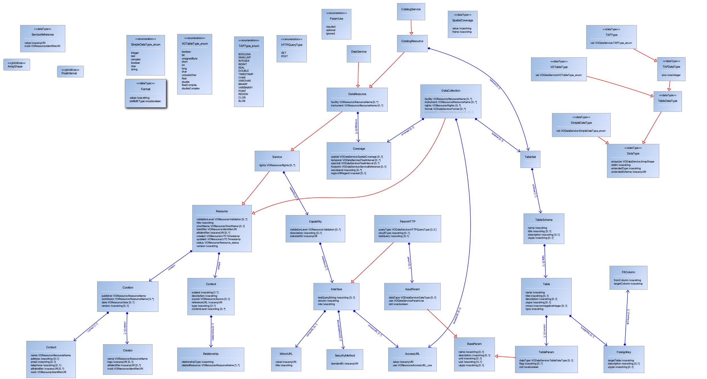

Notes on RegistryDM
====================

The purpose of this is to redefine the registry data model in VO-DML rather than XML schema. 
It is not an aim of this project to make completely faithful representation, but rather to work towards RegistryDM 2.0
using the insights provided by working with the VODML tooling. 

The registry data model is formally defined using the XML schema language
(see https://www.ivoa.net/xml/VOResource/VOResource-v1.1.xsd and associated schema).
The base VOResource and VODataService schema have been converted as well as some select others at this time.

For the purposes of potentially being able to reuse some of the concepts in
the registry data model in other data models, this note describes some of the issues
discovered when translating to VODSL.

Initially, to facilitate mainly automated translation, a vodmltools task vodmlXsdToVodsl was written using
[xsd2dsl.xsl](https://github.com/ivoa/vo-dml/blob/master/tools/xslt/xsd2dsl.xsl) which can take an XML schema document and output a VODSL representation.
This script uses several heuristics based on xml schema design decisions used in registry
schema and so will perform less well on generic XML schema. Even with these
heuristics it is not able to do a perfect job.

### Conversion Issues

* ivo-id -> ivoid (the naming with a - not allowed)
* xs:simpleType not always a dtype (xs:attributes) - e.g. Validation
* SecurityMethod should be dtype

### VOResource Design Issues

* validation levels as numbers not allowed. (check in vodml) Validation should be otype

* creator/contributor not same type....

* ResourceName allows

### VODataService

* ignore STC 1.0!

## RegistryDM 1.2 in VODML

The RegistryDM (designated 1.2 because that is the level of VODataService) looks as below in VO-DML

